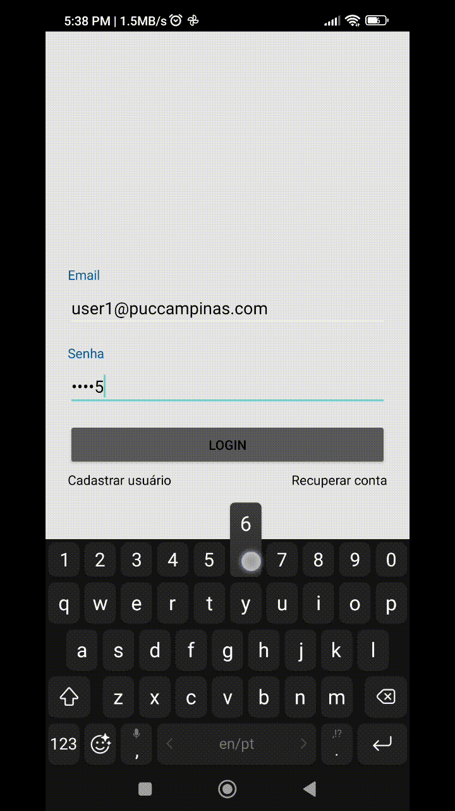

# Aplicativo de Registro de Ponto - Usuário

### Objetivo Principal
Facilitar o registro de entrada e saída dos colaboradores de forma simples e rápida, com geo-localização para validar o local de registro e relatórios de registros de ponto.

### Tecnologias:
Desenvolvimento de aplicativo móvel Android com Kotlin.
Utilização de Firebase para autenticação e armazenamento de dados.

## Demonstração
